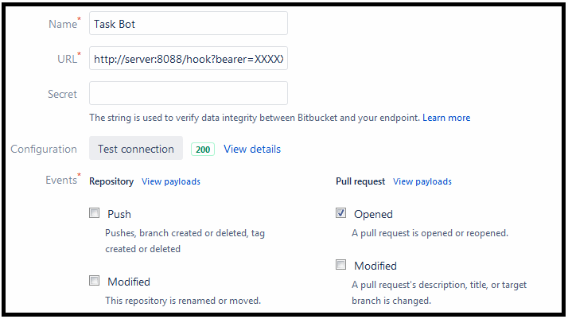

Bitbucket Task Bot
==================

Bot which automatically adds tasks to Bitbucket Pull Requests.

Usage
-----

Create a `workflow-tasks.toml` file in the root of your repository on the default branch (usually `master`).

Here is an example:

    [[workflow]]
    merge = [
      { from = "bugfix/*", to = "master" },
      { from = "feature/*", to = "master" },
    ]
    comment = "Please complete the following tasks:"
    tasks = [
      "Run automated tests",
      "Run manual tests",
      "Document changes",
    ]

    [[workflow]]
    merge = [ { from = "bugfix/*", to = "release/*" } ]
    comment = "Please complete the following tasks before merging to a release branch:"
    tasks = [
      "Run automated tests",
      "Run manual tests",
      "Document changes",
      "Inform release manager",
    ]

The first workflow which matches a given Pull Request (based on the branches that will be merged as defined by `merge` - wildcards supported) will be selected and the Bot will automatically comment it with the given `comment` and add all the given `tasks`.

If no workflow matches, then the Bot will ignore the Pull Request.

The bot application needs to be started up (see below) and configured as a Webhook for the repository in Bitbucket:

Go to *Repository settings* in your Bitbucket repository and choose *Webhooks*.
Create a new Webhook and select only the following event: *Pull Request Opened*.
As URL use: `http://HOST:PORT/hook?bearer=TOKEN` - where HOST and PORT is the server where you are running the bot application. TOKEN is a personal access token of the user which should be used for accessing the Bitbucket API and for commenting Pull requests.
See [Personal Access Tokens](https://confluence.atlassian.com/bitbucketserver/personal-access-tokens-939515499.html) in the Bitbucket documentation. Make sure to URL-encode the token.
Make sure that this user has the appropriate write permissions on the repository to be able to comment pull requests and add tasks.
It is recommended to name this user something like "Task Bot" and to give it a nice avatar symbol.
Press *Test connection* to test access from Bitbucket to the installation of the bot application before saving the Webhook configuration.

Here's how the Webhook configuration should look like in Bitbucket:

Build & Installation
--------------------

To build (for production):

    cargo build --release

To run (in development mode):

    cargo run

To run (in development mode, with automatic reloading on code changes):

    cargo watch -x run

(Cargo watch first needs to be installed using `cargo install cargo-watch`)

To perform linting (see https://github.com/rust-lang/rust-clippy):

    cargo clippy

To perform formatting of all source files:

    cargo fmt

Build within a Docker container and package in Docker image:

    docker build -t bitbucket-task-bot .

Author
------

Hermann Czedik-Eysenberg
